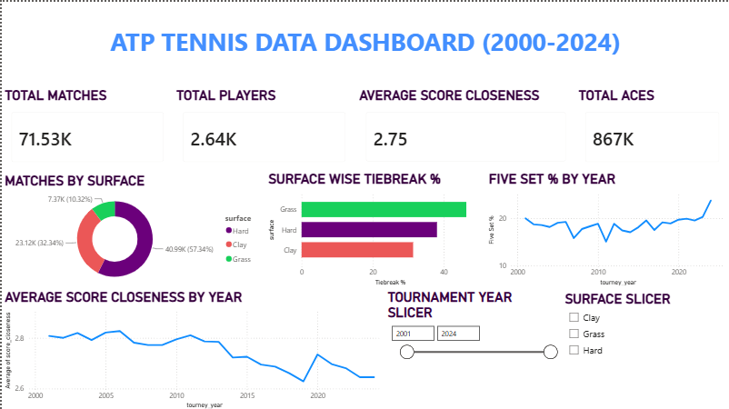
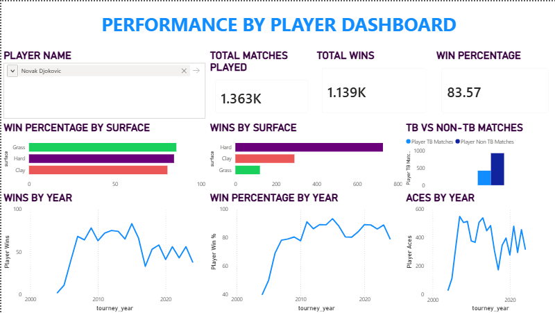
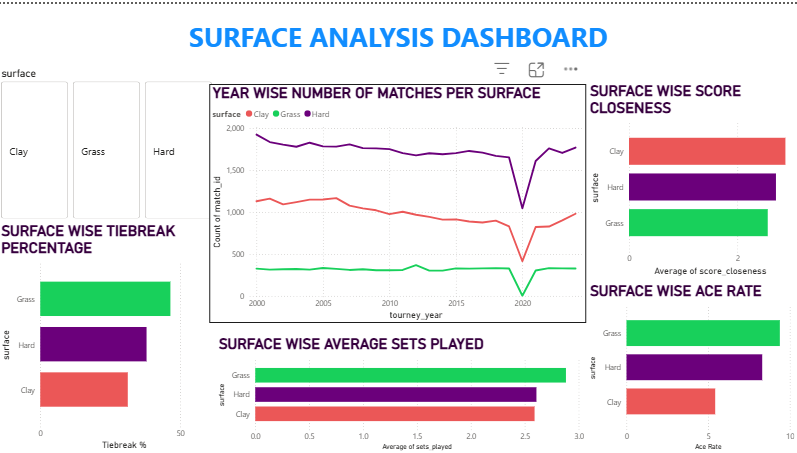
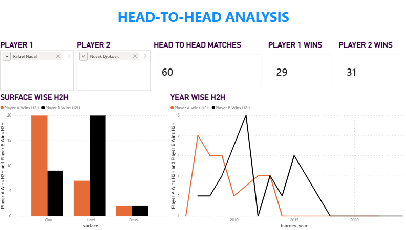

# 🎾 ATP Tennis Analytics Dashboard (2000–2024)

An end-to-end data analytics project built on 25 years of ATP Tour match data. Raw match data was modelled in MySQL, analysed using SQL, and visualized through a 4-page interactive Power BI dashboard.

This project demonstrates how Business Intelligence techniques can be applied to sports analytics — transforming 74,000+ match records into meaningful, interactive insights.

---

# 📊 Dashboard Pages

## 1. Overview

- Tour-wide KPIs — Total Matches, Total Players, Total Aces, Average Score Closeness
- Matches by Surface
- Surface-wise Tiebreak Percentage
- Average Score Closeness by Year
- Five Set Match Frequency by Year
- Interactive Slicers: Year Range, Surface

---

## 2. Player Performance

- Player-specific career analysis via input slicer
- Total Matches, Wins, Win Percentage
- Wins by Surface and Win % by Surface
- Wins by Year and Win % by Year (Career Trajectory)
- Aces by Year
- Tiebreak vs Non-Tiebreak Match Breakdown

---

## 3. Surface Analysis

- Surface-wise Tiebreak Percentage
- Surface-wise Score Closeness
- Surface-wise Ace Rate
- Average Sets Played by Surface
- Number of Matches by Year per Surface

---

## 4. Head-to-Head Analysis

- Compare any two players using dual player slicers
- Total Head-to-Head Matches
- Player 1 Wins vs Player 2 Wins
- Head-to-Head Record by Surface
- Year-wise Head-to-Head Trend

---

# 🛠️ Tools Used

- MySQL 8.0
- MySQL Workbench
- Power BI Desktop
- DAX
- Python (Pandas)

---

# 📁 Dataset

ATP match data (2000–2024) sourced and preprocessed from publicly available ATP match records.

Special thanks to **Jeff Sackmann** for maintaining open tennis datasets that make projects like this possible.

Repository:
https://github.com/JeffSackmann/tennis_MatchChartingProject

---

# ✨ Key Insights

- Rafael Nadal recorded a **90.2% win rate on Clay**, the highest of any player on any surface in the dataset.
- Grass courts produced the highest ace rate (**9.39%**) compared to Clay (**5.43%**).
- Tiebreak frequency peaked on Grass (**46.49%**) and was lowest on Clay (**31.27%**).
- **2006** was the most competitive season based on average score closeness.
- A noticeable dip in match count occurred during **2020** due to the COVID-19 ATP Tour suspension.
- Ivo Karlović recorded the highest Grass-court ace rate at **25.53%**.

---

# 🗄️ Database Design

The MySQL database consists of two primary objects:

### `fact_matches`
- Primary fact table containing one row per ATP match.
- Stores all match-level statistics and metadata.

### `dim_players`
- A derived view containing all unique players from the winner and loser columns.
- Used for player filtering and analysis.

Additionally, **17+ analytical SQL queries** were written covering:
- Surface analysis
- Serve statistics
- Match intensity trends
- Head-to-head records
- Player rankings
- CTEs
- Window Functions

---

# 🚀 Getting Started

1. Clone this repository.
2. Load the dataset into a MySQL database.
3. Open the `.pbix` file in **Power BI Desktop**.
4. Connect Power BI to your local MySQL instance.
5. Refresh the data and explore the dashboard using the available filters and slicers.

---

# 📚 Data Attribution

This project uses data from **The Tennis Abstract Match Charting Project** by **Jeff Sackmann**.

Crowdsourced shot-by-shot professional tennis data by The Tennis Abstract Match Charting Project is licensed under the **Creative Commons Attribution-NonCommercial-ShareAlike 4.0 International License**.

Based on work available at:
https://github.com/JeffSackmann/tennis_MatchChartingProject

This repository is intended for **educational and portfolio purposes only**.

Please respect the original dataset license:
- Attribution is required.
- Non-commercial use only.
- ShareAlike applies.

---

# 🙏 Acknowledgements

A sincere thank you to **Jeff Sackmann** and all contributors to the **Tennis Abstract Match Charting Project** for creating and maintaining one of the most comprehensive publicly available tennis datasets.

---

# 📬 Contact

**GitHub:** https://github.com/yagnitM